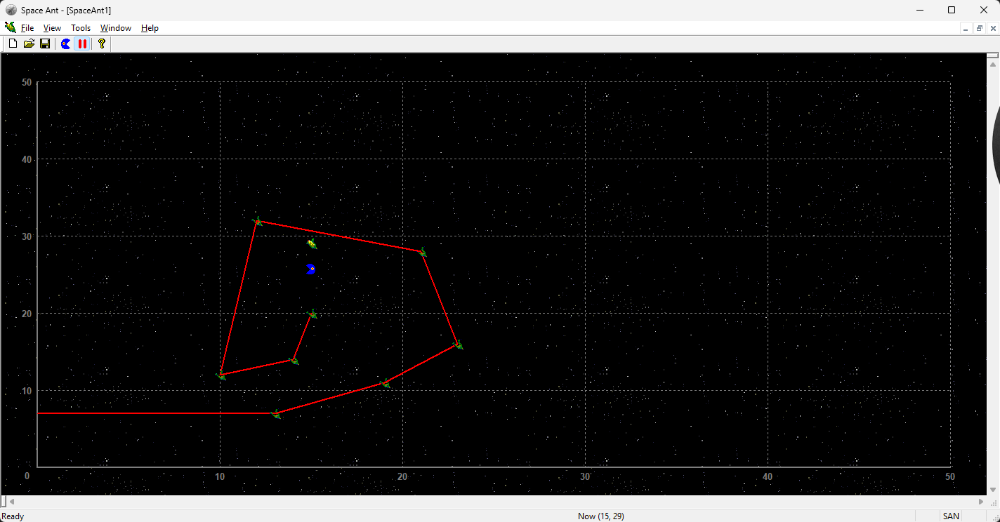

# Space Ant

> **A small graphical math puzzle — 2001.**

Space Ant is a small Windows application created in 2001. It's a math problem called "Blind Bug" or "Blind Snail" visualized as a graphical app.

**Tech Stack:** C++, MFC

**Created:** 2001

 

## Screenshot

 

## About the Puzzle
Because the bug's right eye is blind, it has no idea what is happening on its right side. It can only see, target, and eat grass that is to its left or directly in front of it.
- If the bug moves in a straight line and eats a patch of grass, it will eventually have grass on both its left and right sides. Once a piece of grass gets to its right side, it becomes "invisible" to the bug forever.
- Therefore, the bug must never let any grass fall to its right.

 

## Requirements
- **Windows**
- **Microsoft Visual Studio**
- **MFC** (included with Visual Studio)

 

## License
This project is licensed under the MIT License — see the [LICENSE](LICENSE) file for details.